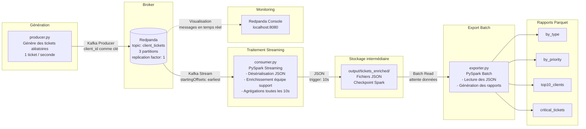

# InduTech — POC Système de Gestion de Tickets Clients


### Description

Dans le cadre d'une migration AWS / Redpanda chez **InduTech**, ce POC met en place un pipeline de données en temps réel pour ingérer, traiter et analyser des tickets clients.

Les tickets sont générés automatiquement par un producteur Python, envoyés dans un topic **Redpanda** (compatible Kafka), consommés et enrichis par **PySpark Streaming**, puis exportés sous forme de rapports **Parquet** pour une visualisation ultérieure.

### Architecture du pipeline



### Stack technique

| Composant | Technologie | Rôle |
|---|---|---|
| Message Broker | Redpanda v26.1.1 | Ingestion des tickets en temps réel |
| Traitement streaming | PySpark 4.1.1 | Enrichissement et agrégations |
| Connecteur Kafka | spark-sql-kafka-0-10_2.13 | Lecture du stream Kafka dans Spark |
| Producteur | Python 3.11 + kafka-python | Génération des tickets |
| Orchestration | Docker Compose | Gestion des conteneurs |
| Format intermédiaire | JSON | Stockage des tickets enrichis |
| Format de sortie | Parquet | Rapports analytiques |
| Monitoring | Redpanda Console | Visualisation des messages |

### Structure du projet

```
projectpanda/
├── producer/
│   ├── Dockerfile            # Image Python 3.11-slim + kafka-python
│   └── producer.py           # Génère et envoie les tickets vers Redpanda
├── consumer/
│   ├── Dockerfile            # Image Python 3.11-slim + Java + PySpark
│   └── consumer.py           # Lit, enrichit et agrège les tickets en streaming
├── exporter/
│   ├── Dockerfile            # Image Python 3.11-slim + Java + PySpark
│   └── exporter.py           # Exporte les rapports en Parquet
├── docker-compose.yml        # Orchestration complète du pipeline
└── README.md
```

### Prérequis

- [Docker Desktop](https://www.docker.com/products/docker-desktop/) installé et démarré
- Accès internet (pour le téléchargement des images et du JAR Kafka au premier lancement)
- Ports disponibles : `8080`, `9092`, `19092`, `9644`, `18081`, `18082`

### Lancement

```bash
# 1. Se placer dans le dossier du projet
cd projectpanda

# 2. Premier lancement (build des images + démarrage)
docker-compose up --build

# 3. Relancement sans modification
docker-compose up

# 4. Arrêt propre
Ctrl+C

# 5. Repartir de zéro (supprime les volumes et données)
docker-compose down -v

# 6. Accéder à la console Redpanda
http://localhost:8080
```

> ⚠️ **Premier lancement** : compter 5 à 10 minutes le temps que Docker télécharge les images et que Spark télécharge le JAR Kafka depuis Maven.

### Fonctionnement détaillé

#### 1. Producteur (`producer.py`)

Génère un ticket aléatoire toutes les secondes et l'envoie dans le topic `client_tickets`. Le `client_id` est utilisé comme clé Kafka pour garantir que tous les tickets d'un même client arrivent dans la même partition.

Chaque ticket contient :

| Champ | Description | Exemple |
|---|---|---|
| `ticket_id` | Identifiant unique du ticket | `TKT-00042` |
| `client_id` | Identifiant du client (clé Kafka) | `CLT-7235` |
| `created_at` | Date et heure de création | `2026-04-16T13:00:01` |
| `request_type` | Type de demande | `Support technique` |
| `request` | Contenu de la demande | `Mon application ne se lance plus` |
| `priority` | Niveau de priorité | `critical` |

#### 2. Consumer (`consumer.py`)

Lit le stream Kafka en micro-batch (toutes les 10 secondes) et effectue :
- **Désérialisation** des bytes Kafka → JSON → colonnes Spark
- **Enrichissement** : ajout automatique de l'équipe support selon le type de demande
- **Agrégations** : nombre de tickets par type et par priorité (affichées en console)
- **Écriture** des tickets enrichis en JSON dans `output/tickets_enriched/`
- **Checkpoint** dans `checkpoint/` pour reprendre après un redémarrage

| Type de demande | Équipe assignée |
|---|---|
| Facturation | Équipe Facturation |
| Support technique | Équipe Technique |
| Retour produit | Équipe Logistique |
| Livraison | Équipe Livraison |
| Information | Équipe Relation Client |

#### 3. Exporter (`exporter.py`)

Attend que des données soient disponibles dans `output/tickets_enriched/`, puis génère 4 rapports Parquet en mode batch :

| Rapport | Chemin | Description |
|---|---|---|
| Par type | `output/reports/by_type/` | Tickets par type de demande et équipe support |
| Par priorité | `output/reports/by_priority/` | Tickets par niveau de priorité |
| Top 10 clients | `output/reports/top10_clients/` | Clients avec le plus de tickets |
| Critiques | `output/reports/critical_tickets/` | Détail complet des tickets critiques |

### Configuration avancée

Les variables d'environnement suivantes peuvent être modifiées dans le `docker-compose.yml` :

| Variable | Service | Valeur par défaut | Description |
|---|---|---|---|
| `BOOTSTRAP_SERVERS` | producer, consumer | `redpanda:19092` | Adresse du broker Redpanda |
| `INPUT_DIR` | exporter | `./output/tickets_enriched` | Répertoire des tickets JSON |
| `OUTPUT_DIR` | exporter | `./output/reports` | Répertoire des rapports Parquet |

### Points de vigilance

- **Données persistantes** : les volumes Docker conservent les données entre les relances. Pour repartir de zéro : `docker-compose down -v`
- **Checkpoint Spark** : le répertoire `checkpoint/` permet à Spark de reprendre là où il s'était arrêté en cas de redémarrage
- **Ordre de démarrage** : géré automatiquement par les `depends_on` et `healthcheck` du docker-compose
- **Exporter** : attend automatiquement que des fichiers JSON soient disponibles avant de démarrer le traitement
- **Performance** : la mémoire Spark est configurée à 2Go par service — à ajuster selon les ressources disponibles


## 🎬 Démonstration / Demo

[![Démonstration du POC]](https://youtu.be/XmL3-nIrxUg)
